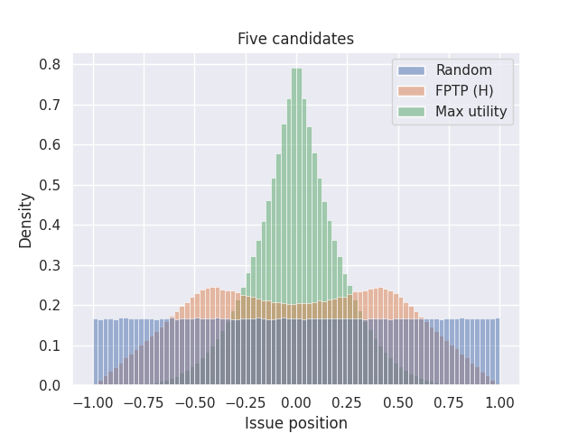

There are a lot of complex and controversial discussions surrounding voting
methods. Here, I try to short-circuit almost all the complexity and introduce a
simplified scenario. Although unrealistic, this reveals what I think is an
important feature of voting methods.

## A Very Simple Scenario

You're on a school basketball team, visiting from out-of-state. You won your last
game, but won’t be returning home until tomorrow. There’s time to catch a movie!
Five movies are showing at a local theater. Some of your teammates want to see
something dramatic, while others want something light and comedic. Others
prefer something in between – enough drama to make you invested, but some humor
as well. The coach insists that everyone goes to the same movie, in the name of
team-building. They pass out ballots…

You’re managing a team in a small office building. There’s one thermostat, but
some argument about the ideal temperature. You list a series of temperature
settings on a ballot, and pass them out…

You’re the owner of a successful and independent breakfast diner. The menu has
two coffee options: regular and decaf. But some customers want a bold, strong,
almost bitter brew, while others want a light and smooth, almost watery cup.
Many want something in between. For a couple of weeks, you offer a “flight” of
coffees with different beans but, most importantly, different strengths. The
flights come with a questionnaire. Given the results, how do you pick one option
(for the regular brew) that makes your customers the happiest?

In real situations, it’s rare to have only one aspect or consideration that
differentiates multiple options, but here we explore an abstract version of this
kind of scenario. Not because it’s realistic, but because it’s tractable. We can
easily reason about what the best outcome should be.

## The Best Outcome

In this type of situation, the best outcome of a *single-winner* election is to
elect that candidate **closest to the middle** of the range. Note the emphasis
on "single-winner" elections. Sure, if you could have two winners, one would
ideally be somewhere near one side, and the other on the opposite side. That's
complicated. One winner makes it simple. The best-representative choice will
always be the one nearest the center.

  Details:
  
  I'm also assuming two simplifying conditions here. (1) There are a very large
  number of voters, and (2) the distribution of preference among voters is
  symmetric "left" to "right." With these conditions met, the mean of the voter
  preferences is very nearly equal to the median. (We'll come back to that
  later.) That candidate closest to the mean or median voter is the *ideal*
  candidate.

So again: The ideal candidate is the one closest to the middle. I can write
that, but can I justify it? Although I think it's obvious, to be perfectly
honest with you, I haven't found an iron-clad justification. I feel that there
should be a symmetry argument that proves this, but I cannot find it yet. It's
certainly true that when there are **two** candidates, all voting methods agree
(the whole subject of what method you use becomes uninteresting), and they all
do elect that candidate nearest the middle. But in general? If you can think of
a good reason why I'm either right or wrong here, I'd love to hear it!

## Two Candidates

Today, you'll see a lot of histograms, without
[explanation](https://en.wikipedia.org/wiki/Histogram) or apology.

When there are two candidates, all the voting methods that I'll present here
will elect the same candidate in every simulated election. It doesn't even
matter how many issues or other kinds of considerations I simulate. All voting
methods are basically the same when there are two candidates. That's probably
worth writing more about, but there isn't time here.

Above I show the distribution (by histogram) of the candidates, as well as the
distribution of the "issue" of the winning candidate. These are the results of
2,000,000 simulated elections, each with two candidates and 100,000 voters.

Two details are worth digging into here...

### Why the Pyramid shape?

Consider one of the candidates: Candidate A. If A is the closest to the middle,
then the other candidate, B, is farther from the middle. If A's position is \(x\),
then the probability that B is farther from the center (zero) than A is \((1-|x|)\).
That's the crux of it.

In the diagram above, if candidate A is at x and is the closest to the middle,
then candidate B is somewhere in the orange region. Since candidates are
equally-likely to be anywhere between -1 and 1, they will occupy the orange
region with probability \((1-|x|)\).

### What's the "Max Utility" Candidate?

Again, my simulated candidates and voters all have a preference drawn randomly
and uniformly between -1 and 1. Overlapping on this plot is also the
distribution of the candidate that has the highest "perceived utility", summed
over all voters. This distribution is *nearly* identical with the distribution
of winning voters, so they both overlap on the graph (the triangle shape)
completely.

#### Perceived Utility

To simulate elections, I create a table of perceived utilities for each voter-candidate
pair. In the case of a single-issue election, a voter's perceived utility for a given candidate
is a simple function of their preference and the candidate's apparent preference,
\(p_{v, i}\) and \(p_{c, j}\).

\[
U(i, j) = -\left|p_{v, i} - p_{c, j}\right|
\]

It's easy enough to verify that in the case of a uniform distribution of voter
positions, total candidate utility maximizes at the mean voter position, as long
as all voters' utility functions are monotonically-decreasing functions of
distance only. My utility function is linear in all these examples, which doesn't
make much difference. (No difference for the ranked methods.)

## More than Two Candidates

Now consider more than two candidates. For example, five.

First-past-the-post voting suddenly looks very unusual! It no longer tends to
elect the centermost candidate, but instead most often picks candidates that are
a little bit out toward the extremes of this issue space. Blue, same as before,
is the distribution of all (or any randomly-selected) candidate. Green is the
distribution of the maximum-utility candidate, which is as we know is the one
closest to the center and which, in these single-issue scenarios, is also the
most-representative candidate. The distribution of FPTP winners, in orange, does
not even peak in the center! It sags!

It's not that centrists don't ever get elected, it's that the (unfortunately)
most common election method makes it a hard for them to win. Many times harder
than it ought to be for them, an effect that gets worse with the number of
candidates on the ballot. We'll see more on this farther down.

### Ranked Choice Voting to the rescue! (Or, not?)

Let's have voting reform! That's what this website is all about, right? (Mostly
no.) That means Ranked-Choice Voting! (No it does not, and you'll soon see one
reason *why* not.) Or for Britons, The Alternative Vote! Or Australians,
Preferential Voting! These are all terrible names for a mediocre voting method:
Instant-Runoff Voting (IRV). It's not "ranked choice voting," because there are
dozens if not hundreds of published voting methods involving ranking candidates,
only one of which is Instant-Runoff Voting. It's not the "alternative" because
again there are so many methods that are not FPTP. "Worst alternative," maybe.
And it's not "preferential voting" because *all* voting methods gather
preference information on the ballots. Okay, I'll pause ranting now and just
call instant-runoff "RCV" from here on out. It's not like "first past the
post" makes any sense either.

I'm showing two methods here, as well as the ideal candidate distribution
in green. Blue is RCV, and orange is a twist on First-past-the-post.
For the orange election-simulation, voters know what the pre-poll results
were (FPTP-honest). Knowing the top-two from that, they all vote for
their favorite of those two front-runners.

I found it surprising that RCV shows a dip in the center here! After
"discovering" this effect, I saw Wikipedia's page on
[Center Squeeze](https://en.wikipedia.org/wiki/Center_squeeze) which shows the
same effect with two issue dimensions. I'll reproduce that later on. Anyway, RCV
is certainly giving better results more often than FPTP with 100% honest voters,
but it's far from ideal, and it's not much better than strategic voters can get
with FPTP. At least the tails, showing how often extreme candidates get elected,
are improved in RCV over FPTP.

I don't yet have a strategic version of RCV coded up. I'm quite interested in
what the results might be with various strategies. RCV can be strongly rewarding
of strategic voter groups, but correct strategies are a little trickier to
assign. For FPTP, the best strategy is obvious. For ranked methods, it's not.
TBD.

#### More math

With five candidates, the distribution of the ideal candidate peaks more
sharply. That's because not just one other candidate needs to be in that orange
region I illustrated above. All the other candidates need to be there too. The
ideal winning candidate distribution is proportional to:

\[
f(x) \propto \left|1 - x\right| ^ {N_{\textrm{cand}} - 1}
\]

#### Fancier graphs

This is just looking at RCV now, but with more stuff added. In blue is the
histogram of the position of the winning candidates. In orange now is the ideal
distribution, \(\left|1 - x\right| ^ {N_{\textrm{cand}} - 1}\), integrated over
each histogram bin and scaled appropriately. In brown is the ratio of the winner
distribution divided by the max-utility candidate distribution. The ratio curve
is on a logarithmic axis on the right side. I'm using a log scale because a
disadvantage of 1/5 is just as severe as an advantage of 5x. Here we see that
our centermost, centrist candidates have just under a 40% chance to win their
elections, while fringe candidates up to a certain point can be almost 4x more
likely to win than they ought to. It's fascinating, and possibly worth trying to
explain, that outside of ±0.75, RCV results match the ideal curve. My lazy and
probably-wrong explanation is that this is showing how RCV has no spoiler effect
when the "spoiler" candidate is farther out in the fringe than the one they compete
against. But there is a kind of spoiler effect, and a very large one, when
two or more candidates are centrists. Both center-squeeze and spoiler effects
describe ways in which adding a less-ideal candidate to a ballot can affect the
winner (failing the independence-of-irrelevant-alternatives criterion).

## Condorcet methods

[Condorcet](https://www.equal.vote/minimax) voting methods have a special property
in these one-issue election simulations. The thorny aspect of Condorcet
is that there is not always a unique Condorcet winner. On some occasions,
election results can show cycles or other kinds of closed loops where, for
example, most voters prefer A over B, B over C, and C over A. Seems irrational,
but it happens. Well, for these single-issue election simulations, that difficulty
vanishes. There is always a Condorcet winner (unless there are ties). So
for this study, I can talk about "Condorcet methods" as if they are just one
method. Yes there are many of them, but in these simulations there are never
any differences between them.

Same graph as above:

Aha! Now we've found a method that always picks the ideal candidate! We're
almost cheating here because there's always a Condorcet winner, but this
result looks extremely promising. There are wiggles out at the fringes, but
the right-side Y axis is autoscaled. You're looking at 1% deviations!
And I don't think it's the voting method causing this. These fringe
effects go down when I increase the number of simulated voters. It's why
I ran with 100,000 voters. The cause of this, I'm fairly certain, is
related to the variance of the mean being smaller than the variance
of the median. Condorcet can elect a more-fringe candidate when the
*median* of the voters' positions fluctuates to one side or the other,
but the maximum utility candidate is more-fringe when the *mean* of the
voters has fluctuated. I can show this qualitatively, but I have not
yet worked out this explanation quantitatively.

## Other voting methods -- Show me **all** the graphs!

Here is First-past-the-post voting, with honest voters. Note the extreme
range of values for ratios when many candidates are on the ballot! Pay
attention to the axis labels on the right, which is auto-scaled.



Here is the same, but with voters using the one-of-the-top-two strategy:



Ranked-Choice (Instant-runoff, honest):



Approval voting, cutoff is halfway between favorite and least-favorite candidate:



Approval voting, cutoff is halfway between favorite hopeful and least-favorite hopeful:



STAR voting, "honest":



STAR voting, scale gap between the two most hopeful candidates:



Condorcet voting (honest):



### Thoughts

Going from bottom-to-top here.

* Condorcet methods in these scenarios, and by this measure, are clearly
  superior to the others. Results are completely unaffected by irrelevant
  alternatives.
* STAR voting is very robust here, but it does show some very minor difficulty
  when centrist candidates are in close competition. (I'm not showing data for
  specifically this effect here.)
* Approval voting is also quite close to ideal, about 10% off at worst, with
  the remarkable characteristic that it does not get progressively worse with
  additional candidates.
* Ranked-choice, even with only three candidates, shows a strong (30-40%) bias
  against centrist candidates and toward moderately-polarized candidates. I
  think this kind of dispels claims that RCV lacks a spoiler effect.
* It's absolutely astonishing how poorly FPTP performs when there are many
  candidates!

### In Politics

In Colorado's 2024 election, Proposition 131 was on the ballot. I voted against
it, mostly because I had done enough of this investigation to guess at the
outcome. The proposition would do two things. First, it would use Ranked Choice
voting for most state-level positions. I'm neither for nor against that, really.
Second, *it would create an **open** primary*, with the top four candidates
going to the final election. That open primary would use FPTP! That part of it,
I was strongly opposed to. Thankfully it did not pass. I believe the people who
worked to get this on the ballot had nothing but good intentions. But it seems
to me they were not well-informed on election science.

Now, previously I've only been looking at *single-winner* election methods.
It's not obvious that the same issues would arise from a top-four primary
election using plurality. So it's back to the simulation...

This open-primary-with-plurality is not unusual in the US these days. Famously,
when Louisiana switched to an open primary system,
[their top-two candidates in 1991](https://www.reddit.com/r/HistoryMemes/comments/1enn9l2/vote_for_the_lizard_not_the_wizard/)
were David Duke (R), a former KKK Grand Wizard and neo-Nazi, and Edwin Edwards
(D), who had a long record of fraud and other crimes. This primary result
illustrates the consequences of the center-squeeze effect in political
elections.

### Bottom-Two-Runoff Instant Runoff

I have to mention here one particular type of Condorcet method:
[Bottom-two-runoff Instant Runoff Voting](https://electowiki.org/wiki/Bottom-Two-Runoff_IRV).

This voting method takes the rules of instant-runoff ("Ranked Choice Voting")
and tweaks one of them. Instead of eliminating the lowest remaining-first-choice
vote-getter, look at the lowest *two* of these and eliminate the one that would
lose to the other in pairwise preference.

That single little tweak makes all the difference! In one issue-dimension, this
completely eliminates this center-squeeze effect! It's a little bit like comparing
FPTP to approval voting. Just change one thing, "vote for one" to "vote for any,"
and you massively improve the level of representation in your election results!

Now, neither I nor anyone else I can find would actually recommend using bottom-two IRV.
If you're going to implement a *good* voting method, there are clearly better Condorcet
methods to pick. I don't have strong, independent analysis that points to one over
others at this point, but those who *have* studied the field more carefully prefer
a few other methods to this one.

But the point is that there exists an alternative to RCV that is hands-down better
in every possible way, and is only a little bit different in its rules. That such
a method exists should simply remove RCV from voting-reform proposals. Yes, voting
reform is important, but you have to do the math and pick a method that's actually
and substantially better than what you're replacing.

## Two dimensions and up

### Comparison with Merrill, Wikipedia

What's the point of going to more issues? It's that there can now be elections
without a Condorcet winner. The various Condorcet methods can start to disagree
with each other. Also, I'm curious if I can reproduce the graphs on Wikipedia:

Closed Limelike Curves, CC BY-SA 4.0 &lt;https://creativecommons.org/licenses/by-sa/4.0&gt;, via Wikimedia Commons

### My version of the same

My voter spread, like the comparison, is twice as large as my candidate distribution.
That makes this effect more pronounced. My FPTP result is with "honest" voters,
but my Approval and STAR results are with the (natural) strategy of separating
the two most hopeful candidates in approval or scoring. Minimax is a Condorcet method.
Now that the issue domain is two-dimensional, we sometimes have elections without
a Condorcet winner. In these simulations this happens only 0.7% of the time.

### Future work

For the comparison above, we've gone from a uniform distribution of issue
positions (for both candidates and voters) to a normal distribution. For
one dimension, I like the simplicity and expectations you get with a flat
distribution. But for multiple dimensions, the normal distribution has the advantage
of being spherically symmetric no matter how many dimensions ("issues") we simulate.
That means that I can simulate any number of issues and plot everything as a function
of distance from the center.

Having said that, my preliminary results are uninteresting. More of the same effect.
I don't feel it's worth polishing and sharing this because I don't have any new
insights from the work. The only thing I've discovered is that with this issue-based
simulation I always seem to get roughly 0.7% of elections having no Condorcet winner.
It doesn't matter how many issues I simulate, or how many voters, or how different the
spread of voter opinion is from candidates. That surprises me. So if I want to
compare different Condorcet methods, I'd like to find meaningful ways to affect this
fraction first.

In any case, once I have more results I'll post here with a follow-up.
