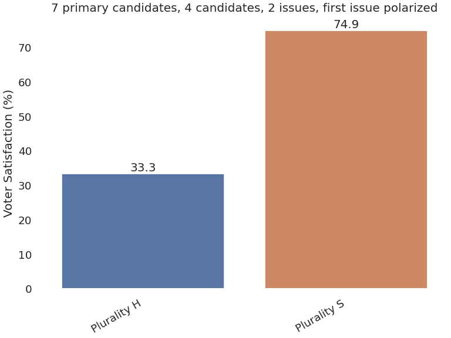
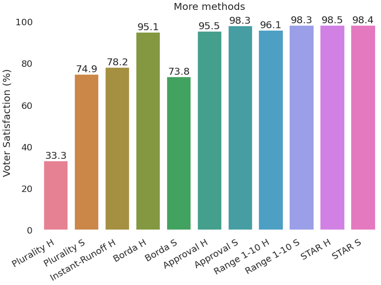
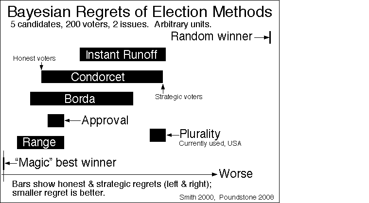
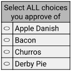

This was a leading question on my mind when I started to write my own voting
simulation. Years ago, a close friend of mine shared with me how he often votes.
To choose who to vote for in high offices, he does a lot of research to find
someone who is scarcely-known but who seems like someone he could fully support.
He writes their name on his ballot. I've always admired this! It shows
dedication and independent thought.

My friend once made a bold claim about this: "If everyone did their own digging
and voted for someone they really liked the *best*, we would all get much better
people into office." Is this true? Intuitively, it feels right.

His approach was an extreme version of "honest voting." I'm not going to dig
into exactly this approach here, because it's more of a discussion of write-in
candidates than anything else. Instead, here I'll look at a much more boring
question. Should I vote for an independent candidate that I like best, or should
I choose only between those candidates that seem likely to win?

## Honest vs Strategic

Every voting method has:
* A ballot
* A method of determining the winner

How a voter expresses their preferences on their ballot is up to them. The most
obvious way to mark a ballot is to answer the ballot question as directly as
possible. This is an "honest" voter. For a [plurality](/reference/methods/plurality)
ballot, the question is (assumed to be) "Which option or candidate do you prefer
above all the others?" I will cover some other voting methods, alternatives to
plurality, further below.

Another obvious and common way for voters to mark their ballots is to consider
it as a game of strategy. "How can I use my vote to have maximum impact
toward my desired outcome? How can I most strongly improve the chances of a more
favorable result to me?" What the ballot might be asking is irrelevant. What matters
is the rules of the game: How is the winner chosen? In a plurality election,
voters can pick only one candidate on their ballot to support. If a voter is
able to guess which candidates ought to have the highest numbers of votes
(the election *hopefuls*), then an optimum strategy would be to vote for their highest
preference *between those*.

Again: Should I vote for an independent candidate if I prefer them to a
major-party candidate? The *self-interested voter* is a strategic voter, and I've
already given you my answer: No. You would have more impact if you restrict your
choice between those (usually two) candidates most likely to win.

<!-- A side note about "*slightly* better chance": What are the chances that your one
vote will swing an election? If it's a very small group of people who are
voting, then your chances are small but once in a while yours would be a
deciding vote. If it's a large group, a single vote hardly ever makes a
difference. But people aren't alone. Many others might feel nearly the same way that
you do. There are groups of people, demographics, who do vote whenever they can,
and other groups who do not. In a representative democracy, that demographic of
citizens who choose not to vote are not represented. If that group of non-voters
are in *every other* way just like those who *do* vote, there's no problem with that. But
that's never the case in reality. The non-voters as a group have a particular
tendency or set of needs and priorities that are different from the rest, and
which go unrepresented. -->

<!--That's almost by definition a major-party
candidate. There will almost always be exactly two such candidates in a
*political* election because of
[Duverger's Law](https://www.rochester.edu/college/faculty/markfey/papers/Exit3.pdf).
(Or watch
[this video](https://youtu.be/HpBRGXK-QNs?si=x3YgpoBLhEvjCKpx)).
-->

While it's obvious that self-interested voters ought to vote strategically, a
more difficult question is: Do honest voters do better for themselves
*collectively* than strategic voters? How should the community-focused voter
play the voting game? Thinking a little in terms of game theory, strategic
voting is the optimal strategy for the individual. But for the whole group, does
honest or strategic voting provide better outcomes?

## Do honest voters do better as a population?

By "do better" I mean: Are people more likely to elect candidates that best meet
the (perceived) needs of the whole electorate?

In the chart above I have simulated 100,000 elections with an initial pool of
seven candidates, which is narrowed down to four candidates through a primary
election process. I have two axes of simulated political issues, one of which is
more broad and somewhat polarized. Even though this is patterned off a political
reality, I do not believe this simulation of candidates and voter
preferences is very realistic. That said, these results seem to be typical of a
broad variety of different configurations. There are 1,000 simulated
voters for each election.

The vertical axis on that chart is average "voter satisfaction efficiency." It
is [explained here](https://electionscience.github.io/vse-sim/) --- I liked
Quinn's idea and used it here. 100% score is achieved when the election method has
elected the candidate who has the maximum total (perceived) utility among all
candidates. I'll claim that this candidate is the "ideal best" candidate for the
group. This metric can be criticized, but I am encouraged by the way this tracks
with many other aspects of voting that are ideal. Voting methods that meet a lot
of important voting criteria tend to also do a good job of picking high-utility
candidates. So unless you're nitpicking about 1% differences here and there,
I'll stand by the claim that this metric is a good one.

And I didn't say it in words yet, but YES -- with strategic voters it looks to
me like people do better, often **much** better, than honest voters given that
the election method is plurality voting. In the simulations above, honest voters
were getting results closer to die-roll elections than they were to actualizing
the will of the people. But strategic voters got more than twice as close to the
"right" answer, on average.

This is not an intuitive answer. Most people I've talked to feel like my
friend's instincts were correct: If everyone votes their heart, the system
will work best. But with voting methods, intuition is not often correct.
Why might it be better to vote strategically? Before I go there, I'll look
at some other voting methods.

## How about for other voting methods?

Here are results for a few other methods from that same batch of simulations:

#### Instant Runoff Voting

I have no strategic version of this method. Strategies are very complicated for
instant-runoff. See for example
[this paper](https://www.journals.uchicago.edu/doi/10.1086/726943). At the
moment I can't weigh in on this. I would very much like to try, but not today.

#### Borda

This is the classic voting method that has bad results when voters are
strategic. Jean-Charles de Borda invented this (he was not the first or last
inventor of it) and said
[what can be translated as](https://en.wikipedia.org/wiki/Borda_count#Effects_on_strategy)
"My scheme is intended for only honest men."

My strategy for this method is really much too simple. (Not an optimal
strategy.) Voters look at the top two leading candidates (from the honest
election), rank their favorite of those two as their #1, and the other one gets
ranked last. All other candidates get ranked according to that voter's honest
preference.

Another strategy that I have not simulated is for the voter to rank their most
favorite candidate first, and the other candidates in reverse order of
popularity. If only one (or a small contingent of) voter(s) does this, they do
help their favorite as much as possible. But it reportedly produces absolutely
terrible outcomes for the whole electorate if everyone does it. The most
unpopular candidate gets ranked #2 on most ballots, and usually wins.

Borda is *not* a good voting method for political or other high-stakes
elections. But for small informal groups making decisions that are not
particularly contentious, the Borda count can work just fine. Not the best, but
for a very small group where you need both a very simple method and for
participants to be able to express more information than they could with an
approval ballot, it's a decent choice. Range voting would be a better choice.

#### Approval, Range, and STAR

These three methods are score-based (okay STAR is hybrid). A score-based voting
system lets you score each candidate individually. Unlike ranked voting methods,
voters can give the same score to multiple candidates. Range voting is
similar to what Amazon, Yelp, Google Maps, etc. use for
ratings. Give something a rating, and find the thing with the highest average
rating. Approval is a minimal score-based system: Voters score each candidate
with either 0 (don't approve) or 1 (approve). As long as you have, say, 100 or
more voters, approval voting does better than I would have expected!

My strategy for all three of these score-based methods is the same. And much to
my surprise, this strategy gives consistently *better* results for the
population than honest voters! I did not expect this.

The honest voter, when scoring, will give their least-favorite candidate the
lowest score, and their most favorite the highest score. Candidates in between
will assign scores on a linear scale between worst and best, according to their
own perceived utilities.

For a strategy, again look at the top-two vote-getters for the honest version of
that same method. Find the score mid-point between these two, and add an
artificial scoring gap there. Above and below the gap, scoring is linear. But
the gap widens the voter's score separation between the two most-hopeful
candidates. The most extreme version of this has voters give the max score to
their favorite hopeful candidate as well as all other candidates they like
better. And the bottom score goes to all the rest. If all other voters do this,
it gives the exact same results as strategic approval voting. No shades of gray.
But for the Range and STAR results above, I used a strategy gap of 75% of the
full range.

Both approval and range scoring (on a 1-10 scale) seem to do *better* when everyone
uses this particular strategy. Yet again, this came as a shock to me!

But STAR voting already has an element designed to reduce the effect of any
strategic voting. STAR stands for "Score, Then Automatic Runoff." It uses a
6-point range-voting ballot -- score each candidate from 0 to 5, inclusive. To find the
winner, first add up all the scores. Find the top two candidates by score total.
Then, count the number of ballots that score one of those top two higher than the other
one, and vice versa. (In this step it does not matter *how* different, just that
the higher-scored one counts as a vote *for* that candidate.) This is a little
bit like strategic range voting. The strategist gets a pre-election "poll" which
is round #1 of STAR. Then they give the final preference info on their real
ballot, which is like round two of STAR. In my simulations, STAR seems to do
about the same with strategic and honest voters. But it has that final-two
separation mechanism already built in, so this shouldn't be surprising.

## Do other studies agree with this?

Years ago I read [an article](https://rangevoting.org/BayRegDum.html) about
comparing voting methods by simulation. It presented a graph that indicated a
range of performance for different voting methods according to how well each
method picked winners that either did or did not maximize summed "perceived
utility" scores of all the voters.

In this simulation and many others that Smith ran, a population of honest voters
always got better results for the electorate than did strategic voters. That's
the **opposite** of what I'm seeing.

To compare this chart with the two I've shown: My 100% is pretty much the same
as Smith's Magic "best" winner on the left. My 0% is Smith's "random winner."

Later I found
[Jameson Quinn's simulation results](https://electionscience.github.io/vse-sim/vse-graph.html),
which had strategic voting being an **improvement** under plurality and a few other
methods.

So for this issue, I agree with Quinn but not Smith. If anyone knows of other
studies of this, I'd be curious!

## Why might strategic voting work well?

The main problem with plurality voting is that voters have to choose only one
candidate to share their evaluation of. Because there is so little information
on the ballots, the method (count all votes for each candidate) cannot often
pick a candidate well. But there is some information, and when it comes down to
the final candidates, the only remaining question is: which one do most people
want? If you reduce a multi-candidate election down to a final two-candidate
election, then all methods do equally well. So if voters know ahead of time
what information is most important for that final pair, they can use their 
limited ballot to communicate only that bit of information that's most needed.

This amounts to changing the question of the ballot. Instead of "who is your
favorite?" The better question is "Which candidate do you feel most needs your
support?" If it's obvious ahead of time that an election will come down to
two hopefuls, then that's the best question to answer.

Now, this does not completely save plurality voting. Knowing what the final
pair of candidates might be is another weakness of plurality. The strategic
voting I'm describing here can't fix that. Ultimately you need a method of
getting some level of information from every voter about every candidate.

But in cases where two leading candidates are well-selected by honest
pre-election plurality polls, strategic voters actually fix the worst, most
glaring problem with plurality: The spoiler effect. I would suppose that fixing
the spoiler effect (in many cases) is the main reason why strategic voting comes
out to the benefit of all voters in plurality elections.

It should be properly shocking that approval voting does so well, at least
according to the simulations I'm showing here. Approval voting is almost the
same as plurality, with just one modification. Instead of "vote for exactly one
candidate," the approval ballot asks "vote for any number of candidates." Punch
away! But you can't vote twice for the same candidate. That's multi-voting,
which (spoiler) does not do as well. But voters *can* share one bit (0 or 1) of
preference information about each and every candidate. Voters don't have the
awful choice to make of which one candidate they weigh in on.

And strategic approval voting takes a basically good method and actually makes
it better. My version of strategic approval voting is to use the free parameter
-- where a voter draws the line between "approve" and "disapprove" -- and sets it
to the optimum value for each voter to communicate that information that's most
needed. When you compare this with plurality voting, voters get the best of both
worlds. They can vote honestly and strategically at the same time. "I like this
*hopeful* candidate, but I also like this other candidate that is in fact my
most favored. I approved of my favorite, which is all I can do anyway, but since
it will probably come down to these other two, I'll weigh-in on that too."

I want to write more about Condorcet methods here, but I don't want to have to
explain it all here first. If you know about Condorcet voting methods, you'll
also see how these automatically include all pair-wise preference information.
So again if all voters can somehow (magically) find the right top-two candidates
before voting, and communicate their final preference as a strategic vote, then
strategic voting with plurality would effectively turn it into a Condorcet
method (whenever a Condorcet winner exists). All the Condorcet methods I have
simulated seem to do about as well as the score-based methods in terms of
voter satisfaction and lack of a center-squeeze effect. For another post.

## It would be nice to not need strategy

Wouldn't it be nice to use an election method where you could express yourself
accurately and honestly, and have just as much of an impact on the election
results as everyone else? That is one of the benchmarks for good voting systems.
First-past-the-post just does not allow this. You don't get to express your
preference for any more than one candidate on a ballot. You need strategy in
order to focus your communication on the most relevant aspect of your
preferences. But other voting methods are much less sensitive to voting
strategies, and those are (for political elections especially) ones to support.

<!--
## The fine print

### Some simulation details

When voting, voters need to ask themselves how well they like each option on the
ballot. For my voting simulation, I abstract all those possible considerations
down to just one number for each voter-candidate pair: A kind of "perceived
utility" -- a measure of how well that voter would feel represented or served by
the given candidate.

Example table of voter-candidate utilities (Numbers here are randomly generated):

| Voter | Leo | Francis | Benedict | John Paul
| :--- | ---: | ---: | ---: | ---: |
| 1 | 0.51 | 0.78 | 0.90 | 0.18 |
| 2 | 0.97 | 0.19 | 0.65 | 0.07 |
| 3 | 0.30 | 0.08 | 0.93 | 0.16 |
| 4 | 0.37 | 0.87 | 0.69 | 0.33 |
| 5 | 0.49 | 0.37 | 0.05 | 0.54 |
| ... | | | | |

From that table, it's not hard to simulate how voters would mark their
ballots. For "honest plurality" elections, each voter votes for the
candidate with the highest utility. Using the table above, voter #1 votes
for Benedict and voter #2 casts their vote for Leo.
 -->

<!-- ## Plot sources

The two charts in this post were generated [in this notebook](close_and_polarized.html).
 -->
